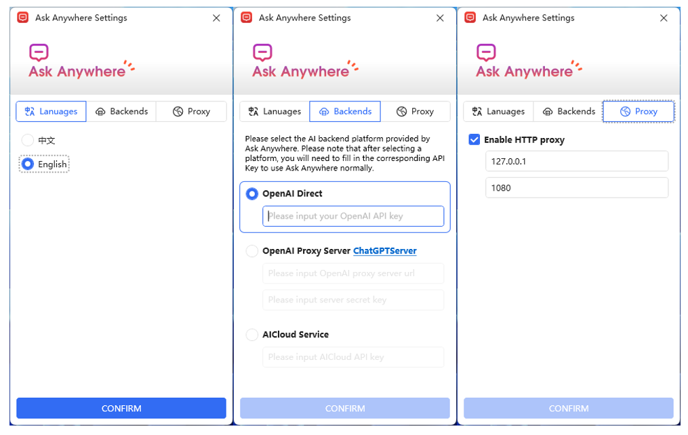

# AskAnywhere

## Ask OpenAI anywhere you like (in Windows) 📝

---

## Features
- Spawn an ask dialog from anywhere with `Ctrl+Alt+?`
- Command triggers starting with `/`
- Code mode and Translator mode support
- Chinese and English language support
- More features on the way

## Limitations
- Occasionally spawn asking bar at wrong position
- Could not output `\n` char for now. 

## Prerequisites
- Running Windows 10(19041+) or Windows 11 system
- .Net 6.0 Runtime
- OpenAI API Key

## Quick Start
- Download binary package from release page.
- Start by double click on `AskAnywhere.exe` in the binary folder.
- A settings dialog will popup on first run, properly set your api key information and click `Confirm` button.
- Done! Use `Ctrl+Alt+?` to spawn ask bar at your caret position.

## Building
- Start by installing VisualStudio 2022, with .Net Desktop Development workload.
- Check if .Net 6.0 SDK is properly installed.
- Double click `AskAnywhere.sln` to open solution.
- Build!

## Screenshots
- Settings

- Ask mode

